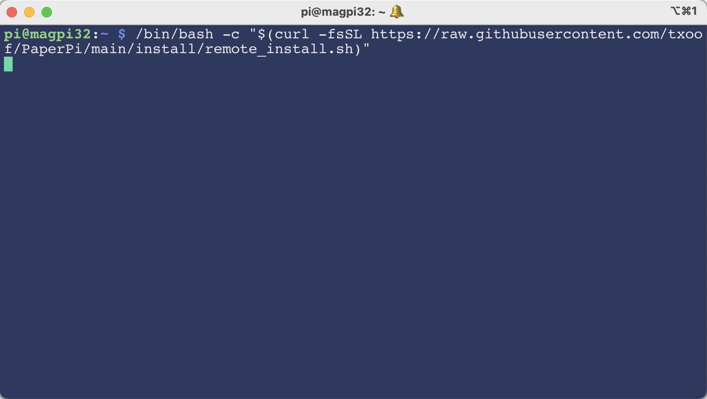
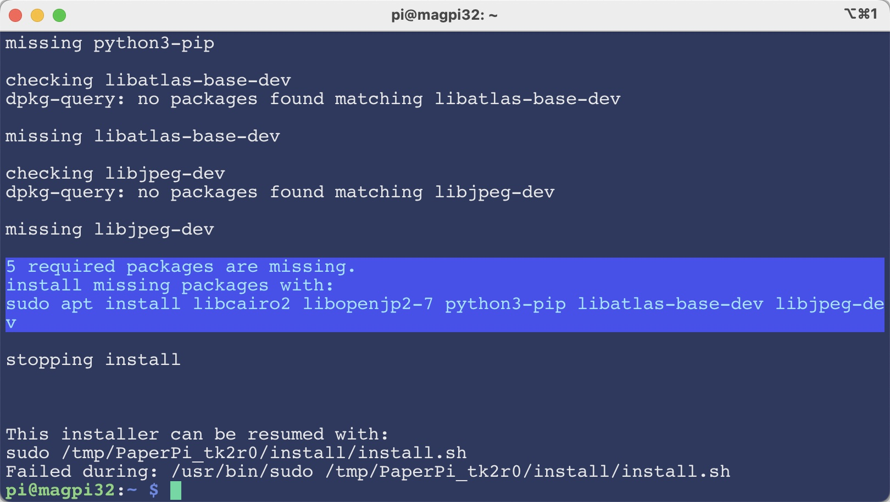
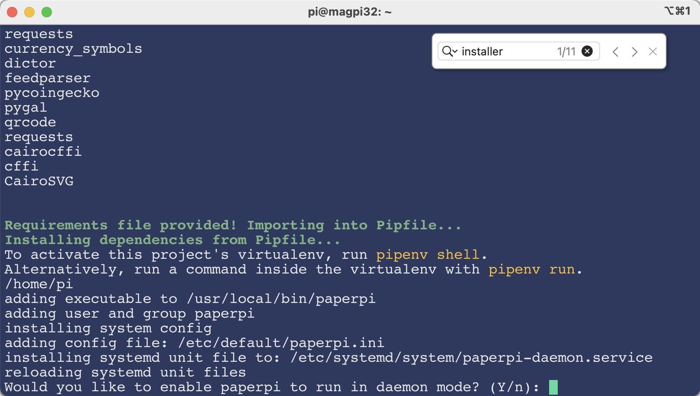
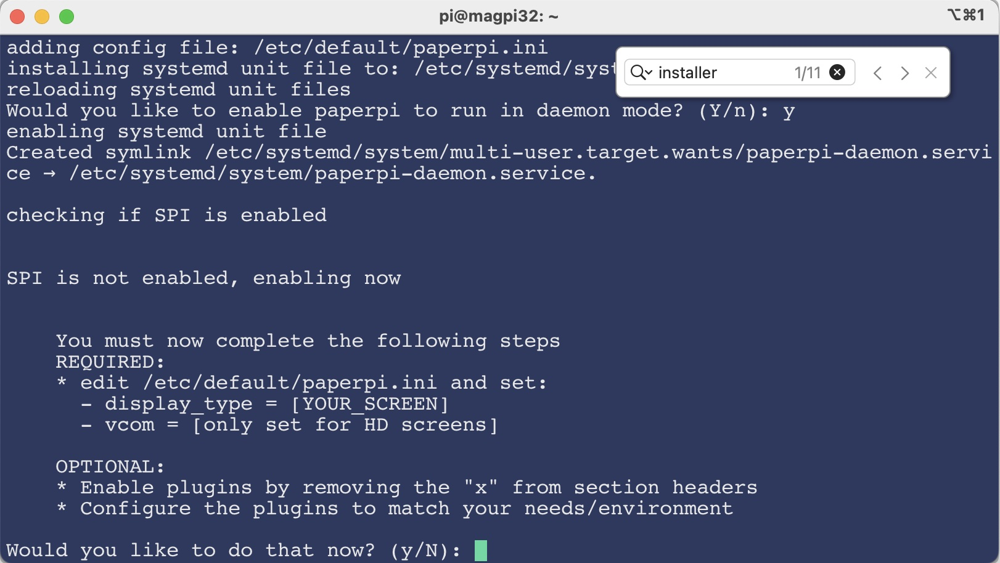

# PaperPi Step-By-Step Instructions

If you're new to Linux and Raspbian, you may find these instructions helpful. 

## Installation

Gather your chosen SPI based screen, a Raspberry Pi with a version of RaspberryOS installed. Either the lite or desktop version will work just fine for this project.

We recommend starting with a fresh install so you know everything is working and there's no chance that you'll burn up anything precious if you make a mistake.

### Step One: Plug in the Screen:

* **START WITH THE RASPBERRY PI POWERED OFF!** Hot plugging the driver boards is a great way to let the magic smoke out of the board or ruin the display.
* Seat the driver board on your Pi's GPIO headers. For the most part, the board should sit logically on the GPIO pins so it looks like the Pi is wearing a "hat". When in doubt, check the [WaveShare wiki](https://www.waveshare.com/wiki/Main_Page#Display-e-Paper) for instructions for your driver board.

### Step Two: Boot your Pi and install PaperPi

We will be working in the Terminal for most of the setup. There won't be a ton of typing or obscure commands, but there will be a few. If this makes you nervous, or you're not even sure how to launch a terminal, check this great article over at [MagPi](https://magpi.raspberrypi.com/articles/terminal-help).

* Fire up your Pi, log in and fire up a terminal
* Update the debian packages with `sudo apt update && sudo apt upgrade`. Answer 'Y' to install the packages when prompted
* Copy and paste the following command into the terminal and press ENTER to download the installer script. Make sure you don't leave off any quotation marks or any other bits. This step can take a while

```shell
/bin/bash -c "$(curl -fsSL https://raw.githubusercontent.com/txoof/PaperPi/main/install/remote_install.sh)"
```


* The installer will likely find some missing packages and prompt you to install them. 
* **TIP:** you can restart the installer -- look for a line like this: `This installer can be resumed with: sudo /tmp/PaperPi_tk2r0/install/install.sh` 
* Restart the installer by either resuming, or starting fresh



* If you've restarted the installer, you may not need to do this step
* The installer may pause and may ask you for the `[sudo] password` for your user (usually `pi`). This is the password you use to sign in, or the default password (`raspberry`)
* The installer needs the super user password so it can copy files into system locations. BE CAREFUL about entering your sudo password to any program you don't trust. This is part of the reason we tell you to start with a fresh install. We hope you trust us!
* The installer will ask if you want to run in daemon mode. This means that PaperPi will always be running. It will start automatically, and restart if it crashes. This is perfect if you want PaperPi to run all the time. If you would like to be in control of when it starts, you can answer 'N' to this question.



* The installer will prompt you set up your configuration. Make sure you answer 'Y' when asked to automatically open the installer in an editor. 

### Step Three: Configure PaperPi

The next stage of installation is configuring PaperPi 

* The installer will ask if you would like to configure the daemon configuration for  PaperPi. Make sure you answer 'Y'



* During this step you will need to set up a few things in the `[main]` section and a few more things to get the plugins working
* Set the `display_type` to match your particular display. Check the [README](../README.md) for a list of all the supported screen names. 
* If you are using an HD screen, you will also need to set the `vcom` value. Find the `vcom` value on the ribbon cable (this should be a negative number)
* You can leave the rest of the `main` section alone.

```ini
 CONFIG_VERSION=1
[main]
# waveshare display type use HD for IT8951 displays
display_type = epd5in83
# required vcom value for IT8951 screens
vcom = 0.0
# maximum refresh between total screen clear for HD displays
max_refresh = 4
# logging output level
log_level = WARNING
# display splash screen (True or False)
splash = True
# rotation of EPD display
# (cable bottom: 0; cable left: -90; cable right: 90; cable top: 180)
rotation = 0
# mirror screen outuput - useful if output to screen appears backwards
mirror = False
```

* To configure the plugins you should pick a few you would like to use and remove the `x` from the plugin name.
* All plugin names need to start with `[Plugin: ]` to be enabled

```ini
[Plugin: Word Clock]
layout = layout
plugin = word_clock
refresh_rate = 125
min_display_time = 255
max_priority = 2
```
* Some Plugins need some extra information to set up. Check the [Plugin documents](./Plugins.md) for information on setting up each plugin.
* When you're done press `CTRL + X` to exit the editor. Make sure you answer 'Y' to save your changes

### Start Paper Pi

PaperPi is now ready to run and just needs to be started as a daemon!

* Type `sudo systemctl start paperpi-daemon.service` on the prompt to get it started
* If everything worked, you should see the splash screen and your first plugin show up a few seconds later

## Trouble Shooting

If things don't go smoothly there's a few things you can do to figure out what went wrong.

1. Check the system log type `tail -f /var/log/syslog`. Look for lines that start with paperpi to get some clues as to the problem
2. If this doesn't help, edit the config file and set the log level to 'DEBUG'. `sudo nano /etc/defaults/paperpi.ini`
3. Restart paperpi: `sudo systemctl restart paperpi-daemon.service` and check the logs again and see if there's anything more useful 
4. If you're still struggling to figure out what went wrong stop paperpi with `sudo systemctl stop paperpi-daemon.service`
5. Start paperpi manually with `sudo /usr/local/bin/paperpi -d` this should output all the logs directly to the terminal making it easier to follow. Press CTRL+C to stop PaperPi

If you are still stumped and can't figure out what's wrong, head over to [PaperPi on Github](https://github.com/txoof/PaperPi/issues) and open a ticket. Let us know what you've tried and what problem you're having. We'll do our best to help you out.